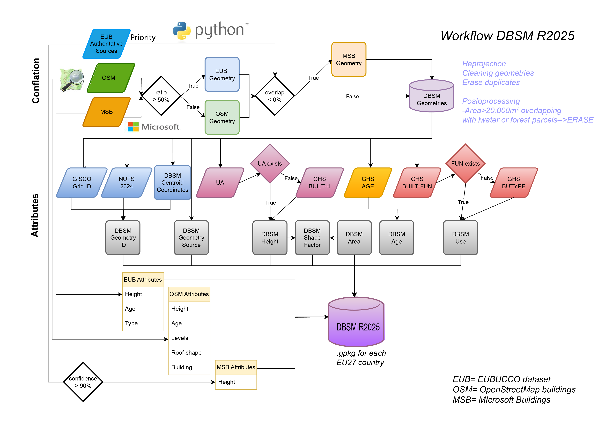
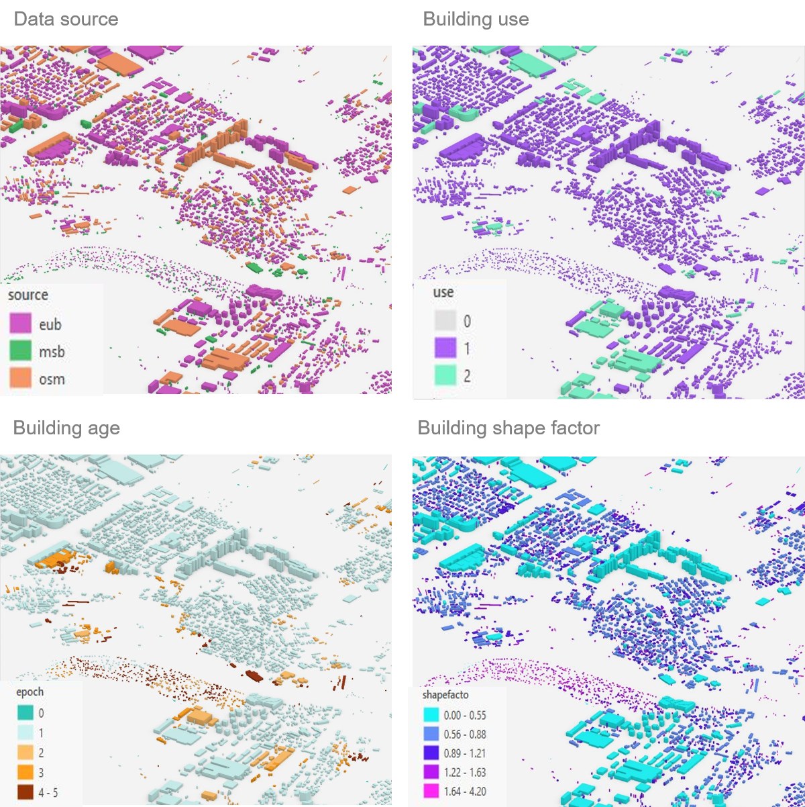
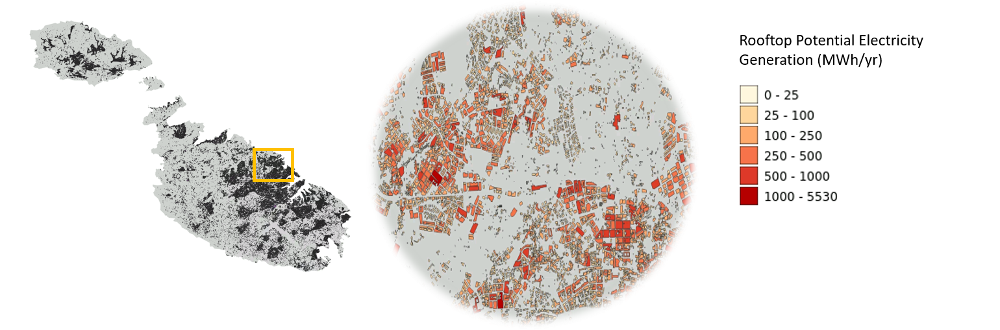

# 🏛️ EU Digital Building Stock Model (DBSM R2025)

The **EU Digital Building Stock Model (DBSM)** provides a detailed and comprehensive and homogeneous **geospatial database of individual buildings** across the European Union. While primarily focused on **energy-related characteristics**, the model supports a broad range of applications.DBSM enables bottom-up solutions from individual building level to entire neighborhoods and national scales.

This initiative aims to support major EU energy policies—such as the **Energy Performance of Buildings Directive (EPBD)**—by enabling **data-driven, targeted investment decisions** in line with the **EU Renovation Wave**. DBSM also supports the **European Affordable Housing Initiative** by enabling high-resolution "**what-if**" analyses and assessments.

---

## 📁 Repository Structure

This repository contains four scripts that replicate the **conflation** process of **DBSM R2025** and estimate the **rooftop PV potential** at building level:

### 🔹 `step0`: Conflation Core (DBSM R2025)
This is the core script of the DBSM pipeline.

**Inputs required (per country):**
- [`EUBUCCO`](https://eubucco.com)
- [`OpenStreetMap`](https://www.openstreetmap.org)
- [`Microsoft Building Footprints`](https://github.com/microsoft/GlobalMLBuildingFootprints)

**Main tasks:**
- Validates and repairs input geometries
- Reprojects all layers to **EPSG:3035**
- Merges building datasets into a harmonized layer

---

### 🔹 `step1`: Postprocessing
Cleans and filters the merged building layer:
- Detects and removes **duplicate and overlapping buildings**
- Removes **false positives** and buildings <5 m²
- Flags buildings overlapping **water or forest parcels**

---

### 🔹 `step2`: Attribute Assignment & Cleanup
Prepares the building layer for analysis:
- Assigns a **unique building ID**
- Removes duplicate geometries
- Harmonizes the attribute table
- Computes basic descriptive statistics

🔗 External processing required:
Use the [**JRC Building Data Integrator**](https://code.europa.eu/jrc-ghsl/building-data-integrator) to enrich buildings with:
- Height  
- Use  
- Shape factor  
- Construction epoch

---

### 🔹 `step3`: Rooftop PV Potential Estimation
- Estimates **rooftop PV potential** at the **building level**
- Outputs country-level results as `.gpkg`

📘 Full documentation available at:  
[**EU PV Potential Publication (JRC, 2024)**](https://op.europa.eu/en/publication-detail/-/publication/d418ba32-473e-11f0-85ba-01aa75ed71a1/language-en)
PLUS HERE THE LINK OF THE PUBLISHED PAPER

📝 Attribute field definitions are provided in the **Annex** of the publication:  
🔗 **[LINK TO PAPER final version]**

## 🔧 Workflow Overview

The following figure illustrates the DBSM R2025 processing workflow:

### Dataset 
🔗 **[Insert LINK HERE to the dataset]
---

## Visual example DBSM R2025 attributes

## 📦 Installation

No installation is required. The scripts are tested with **Python 3.10+**.

### ✅ Required Dependencies

## Installation

No installation is required. The script is tested with **Python 3.10**.

### Dependencies

Make sure the following Python packages are installed:

  - python=3.10.12
  - numpy=1.24.4
  - pandas=2.2.1
  - shapely=2.0.3
  - geopandas=0.14.0
  - pyogrio=0.7.2
  - pyrosm
  - folium
  - matplotlib
  - tqdm
  - joblib
  - pycountry
  - logging
  - configparser
  - os (standard library)
  - glob (standard library)

### Application
The DBSM supports decision-making across a variety of sectors and use cases:

🏘️ Affordable housing and energy policy support

⚡ Energy efficiency assessments and building renovation strategies

🏢 Energy consumption modeling at the building and neighborhood scale

🔌 Grid optimization and smart city planning

🌱 Sustainable development and resource management

☀️ Assessment of PV and BIPV (Building-Integrated Photovoltaics) potential

🌊 Disaster risk management, including flood and earthquake vulnerability

🏙️ Urban planning and land-use management

💰 Investment analysis and property valuation

📈 Demographic modeling and infrastructure forecasting

## Support

For any questions or support, please contact:
- Georgia Kakoulaki — [georgia.kakoulaki@gmail.com](mailto:georgia.kakoulaki@gmail.com)  
- Ana M. Martinez — [ana.martinez@ec.europa.eu](mailto:ana.martinez@ec.europa.eu)
  
## Authors and Acknowledgment

**Author**  
 Georgia Kakoulaki    
European Commission, Joint Research Centre (JRC)

**Acknowledgments**  
The author would like to thank the following colleagues for their support and great collaboration during the development of the **DBSM R2025**:
- Ana M. Martinez
- Pietro Florio  
- Panagiotis Politis  
- Sergio Freire  
- Katarzyna Krasnodębska  
- Olympia Gounari  

### License
EUROPEAN UNION PUBLIC LICENCE v. 1.2
EUPL © the European Union 2007, 2016
